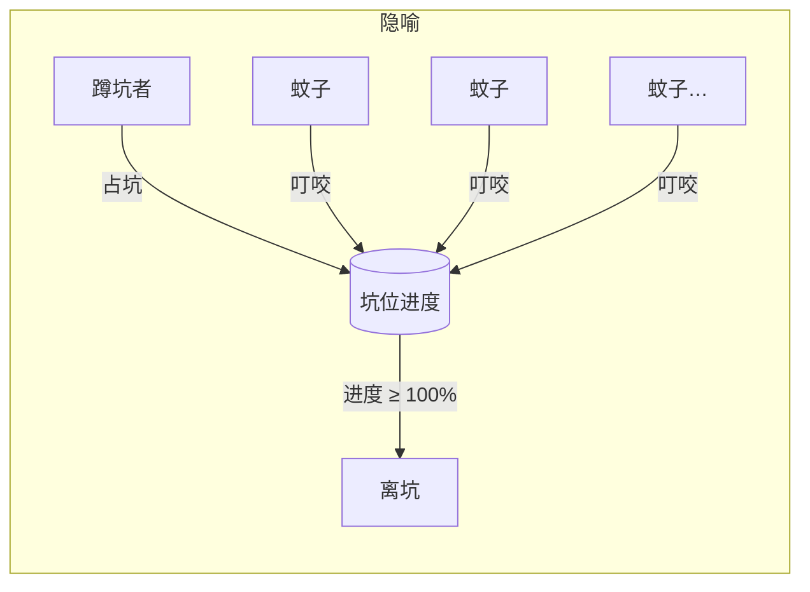
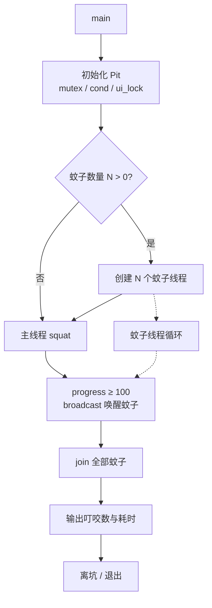
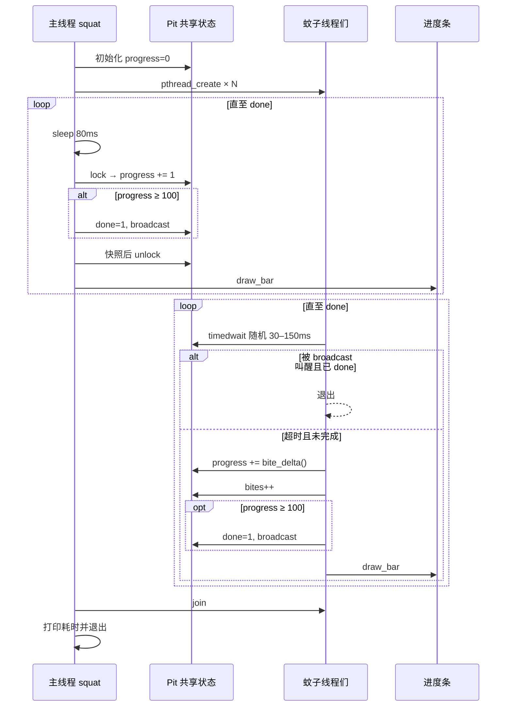
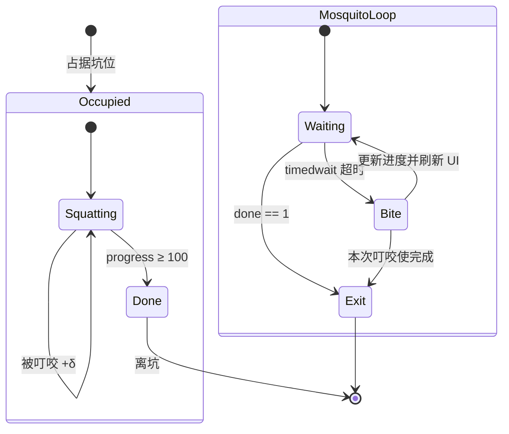
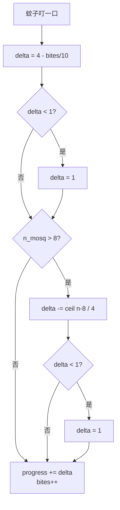
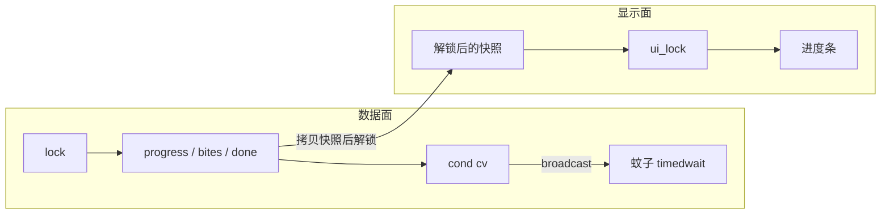

# 旱厕蹲坑算法

用并发编程模拟「占坑蹲着 + 蚊子袭扰加速完成」的过程：主线程是蹲坑者，蚊子是工作线程；叮咬推动共享进度，进度到 100% 即离坑。

## 原理概览

| 角色 | 实现 | 行为 |
|------|------|------|
| 坑位 `Pit` | 共享状态 + 锁 / 条件变量 | 保存进度、叮咬次数、完成标志 |
| 蹲坑者 | 主线程 `squat` | 每 80ms 自身 +1 进度（慢） |
| 蚊子 | `pthread` 工作线程 | 随机间隔叮咬，按公式加进度（快） |
| UI | 进度条 | 叮咬或自身推进后刷新；持 `ui_lock`，丢弃过期快照 |

核心直觉：**袭扰越猛，完成越快**；但叮咬收益会递减，蚊子过密还会互相干扰，避免「线程越多越好」的线性幻觉。



## 整体架构



## 主流程



## 蹲坑者与蚊子状态机



## 叮咬收益公式

每次叮咬增加的进度不是常数，而是：

\[
\delta = \max\!\Bigl(1,\; 4 - \lfloor bites / 10 \rfloor - \bigl\lceil \max(0,\; n - 8) / 4 \bigr\rceil\Bigr)
\]

其中：

- `4`：基础叮咬收益（`BITE_BASE`）
- `⌊bites / 10⌋`：累计叮咬越多，单次收益越弱（递减）
- `n > 8`：蚊子过密时互相干扰；超额按 `⌈(n-8)/4⌉` 扣减（`INTERFERE_THRESH`）
- 下限为 `1`（`BITE_FLOOR`），不会叮了没效果

实现上用整数 `(overcrowded + 3) / 4` 计算向上取整，保证第 9 只起就生效。



因此：

- **0 只蚊子**：只靠自身每 tick +1，最慢（约 8s）
- **适量蚊子**：叮咬主导加速，明显变快
- **过多蚊子**：单次收益被压到下限，加速出现边际递减

## 同步与 UI 原理



要点：

1. **`lock`**：保护 `progress` / `bites` / `done`；叮咬与自身推进都在锁内修改。
2. **`cv`**：完成时 `broadcast`；蚊子用 `pthread_cond_timedwait`，既可定时叮咬，也可被提前叫醒退出。
3. **先改状态，再解锁，再画 UI**：避免持锁做 `printf` 堵住所有蚊子。
4. **`ui_lock` + 单调刷新**：并发刷新时丢弃更旧的快照，防止进度条回跳。

## 关键参数

| 宏 | 默认值 | 含义 |
|----|--------|------|
| `PROGRESS_GOAL` | 100 | 完成阈值 |
| `NUM_MOSQUITOES` | 5 | 默认蚊子数 |
| `BASE_TICK_MS` | 80 | 蹲坑者推进间隔 |
| `BASE_PROGRESS` | 1 | 自身每 tick 增量 |
| `BITE_BASE` | 4 | 叮咬基础收益 |
| `BITE_FLOOR` | 1 | 叮咬收益下限 |
| `INTERFERE_THRESH` | 8 | 开始过密干扰的蚊子数 |
| `MAX_MOSQUITOES` | 64 | 允许的最大蚊子数 |

## 编译与运行

```bash
cmake -S . -B build
cmake --build build

./build/avoidbite        # 默认 5 只蚊子
./build/avoidbite 0      # 无蚊子，最慢
./build/avoidbite 20     # 过密，干扰生效
```

```bash
cmake --build build --target clean   # 清理
rm -rf build                          # 彻底删除构建目录
```
